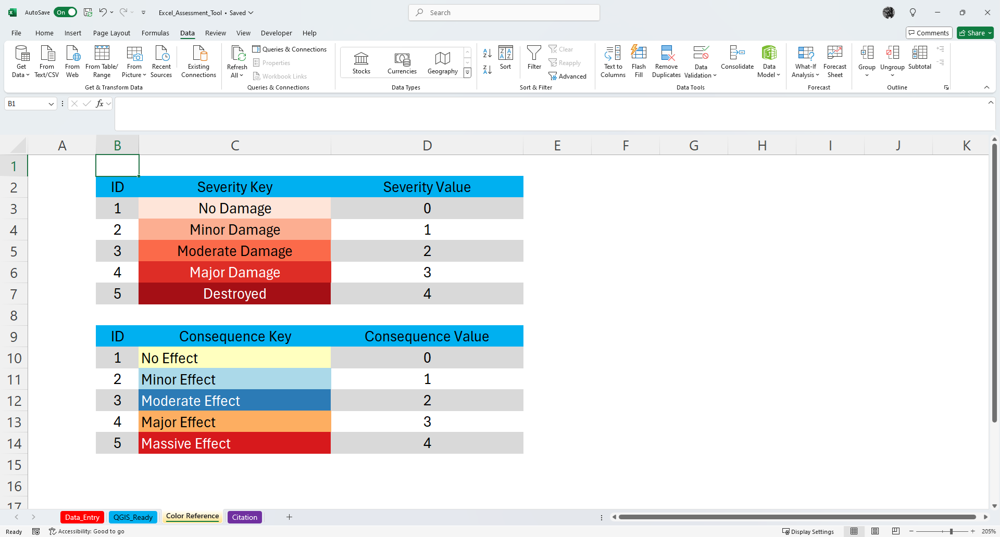
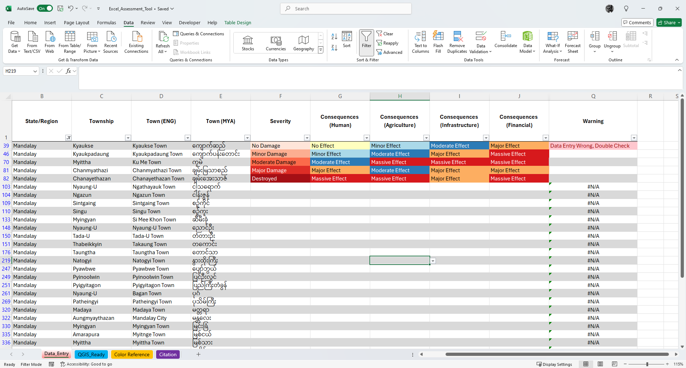
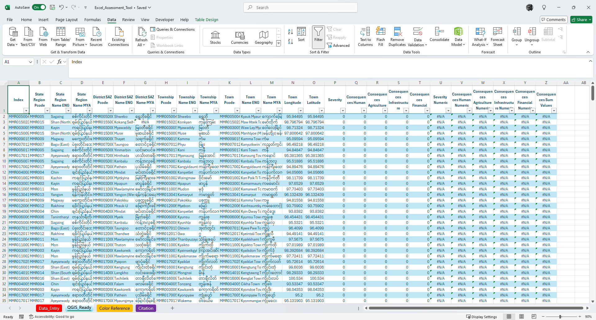

---
# About INDRA  

INDRA Innovation & Communication is a Mandalay-based tech group formed by members with proven experience in mass communication and public relation, design, software development, geographic information management (GIS) and remote sensing, peace and conflict research, data science, robotics and IOT application development. The founding members have diverse expertise and experience in social science, computer science and engineering disciplines.

## Disaster Damage Assessment Tool
Recently, several regions in Myanmar were severely impacted by floods, exacerbating an already dire situation marked by ongoing political instability and widespread clashes across the country. While I am currently unable to provide direct support to the affected communities, I am closely following the distressing news with a heavy heart. This evening, I decided to create a simple, user-friendly data mapping and visualization tool that can be used with office applications. In brief, this Excel data collection tool is available for anyone who finds it useful. If you'd like to modify it, please feel free to do so. It is released under the GNU license, allowing you to adapt and use it as you see fit.

## Usage
It is a simple matrix with five levels and corresponding colors. Please refer to the screenshot below.

### Severity 
- No Damage
- Minor Damage
- Moderate Damage
- Major Damage
- Destroyed

### Consequence (Human, Agriculture, Infrastructure, Financial)
- No Effect
- Minor Effect
- Moderate Effect
- Major Effect
- Massive Effect

I have included all towns in Myanmar. If you are conducting a damage assessment for a specific region, please use the dropdown filter. Refer to the example in the screenshot below.

After adding data, you can copy/paste GIS/Google Earth-ready data in “QGIS_Ready” sheet. I used MIMU Pcode version 9.5 (Feb 2024 Release). 

